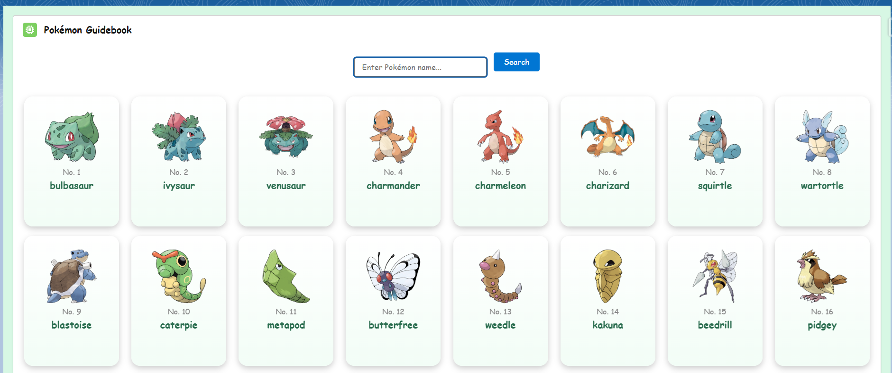

## ✨ Features
- Load Pokémon in **batches** from the PokéAPI.
- **Search Pokémon by name** with debounce.
- **Cache Pokémon details** locally.
- Uses **Custom Metadata & Named Credentials** for endpoint configuration.
- Lightning Web Component UI with **images, stats, and abilities**.

## ⚙️ Setup
1. Create a **Lightening Component Tab** with **Pokedex** component and add it to any of your lightening app.

## 🖼 Screenshot

## 🛠 Technologies
- Salesforce Apex  
- Lightning Web Components (LWC)  
- Named Credentials  
- Custom Metadata  
- PokéAPI
